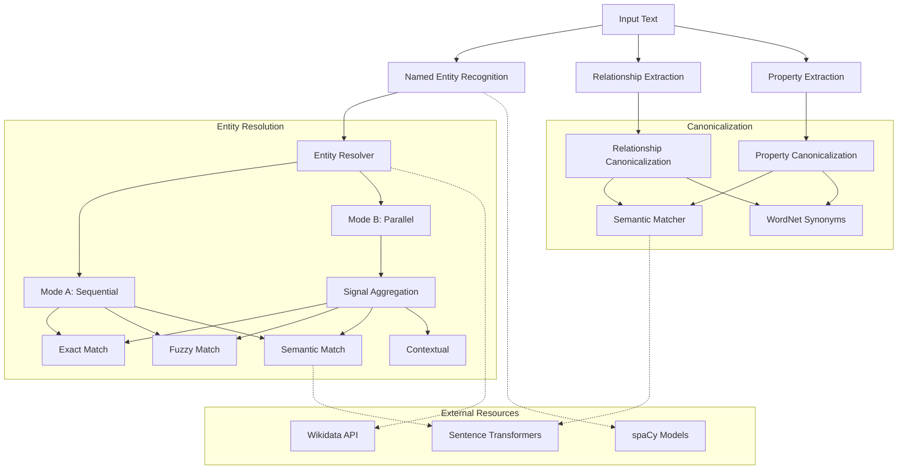

# System Architecture

This document describes the high-level architecture of the **Advanced Text Processing** library.

## Overview

The library is designed as a modular pipeline for processing text, identifying entities, and canonicalizing them into structured data. It combines rule-based approaches, statistical methods, and deep learning models.

## Core Components

## Component Details

### 1. Named Entity Recognition (NER)
- **Implementation**: Wraps `spaCy`'s pipeline.
- **Function**: Identifies spans of text representing entities (PERSON, ORG, GPE, etc.).
- **Output**: Typed entity spans.

### 2. Entity Resolver
The core engine for mapping mentions to canonical entities.

#### Mode A (Sequential Pipeline)
Designed for efficiency. Checks methods in order of cost/precision:
1. **Exact Match**: Hash-based lookup (O(1)).
2. **Alias Match**: Dictionary lookup of known aliases.
3. **Fuzzy Match**: Levenshtein/Jaro-Winkler distance on candidates.
4. **Semantic Match**: Cosine similarity of embeddings.

Stops as soon as a high-confidence match is found.

#### Mode B (Signal Aggregation)
Designed for difficult cases. Runs all signals in parallel:
- **String Similarity**: Character-based metrics.
- **Token Overlap**: Jaccard/Dice coefficients.
- **Semantic Similarity**: Vector embedding distance.
- **Contextual Clues**: Acronyms, co-occurrence.

Aggregates scores using a weighted voting system to determine the best match.

### 3. Canonicalization System
Normalizes relationships and properties to a standard schema.

- **Semantic Matcher**: Uses `sentence-transformers` (e.g., `all-MiniLM-L6-v2`) to encode input text and schema terms into a vector space. Finds the nearest neighbor using cosine similarity.
- **WordNet Integration**: Provides linguistic synonyms when semantic matching is disabled or fails. Uses `nltk` and `spacy-wordnet`.
- **Morphological Processing**: Uses `spaCy` for lemmatization and part-of-speech tagging to handle tenses and variations (e.g., "running" -> "run").

### 4. Data Sources & Storage
- **Wikidata**: Used for "cold start" alias retrieval. Fetched via API with caching and rate limiting.
- **In-Memory Storage**: Current implementation stores entities and indices in RAM.
- **ANN Index**: Uses `FAISS` or `hnswlib` for fast vector similarity search over large candidate sets.

## Design Principles

1. **Modularity**: Components (Scoring, Candidate Generation, Storage) are decoupled interfaces.
2. **Configurability**: All thresholds, weights, and model choices are configurable via `Config` objects.
3. **Hybrid Approach**: Combines the precision of rules/dictionaries with the recall of deep learning.
4. **Performance**: Heavy models (Transformers) are cached; expensive operations are gated behind cheaper checks.
